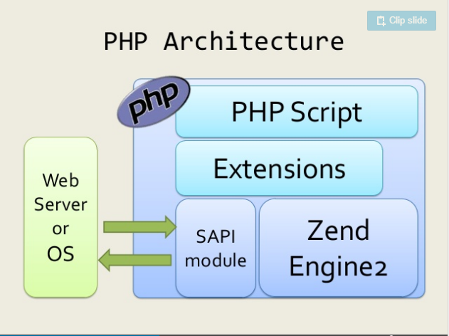
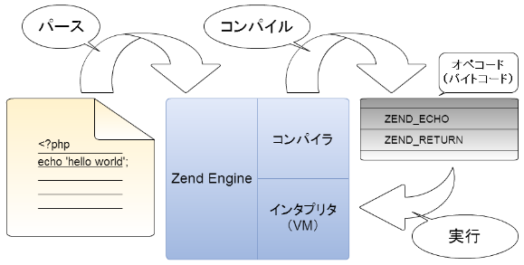

==========
1.はじめに
==========

1.1.本ガイドの目的
==================

　本ガイドでは、PHP の拡張モジュール（以下、Extension と呼びます）を開発するための情報を提供します。

　PHP には非常に多くの機能が実装され、すでにかなりのことを PHP だけで実現できるようになってきています。PHP 以外の外部ライブラリ（例：数値演算や zip、XML 等）や外部システム（例：RDBMS や LDAP 等）を利用する場合も、それらの多くについてバインディング（連結機能）としての Extension が提供されており、これらを介して間接的に利用することができます。逆に言えば、バインディングが提供されていない外部ライブラリの機能を、PHP から直接呼び出すことはできません。

　ただし、PHP の Extension を開発するためのしくみ（SDK - Software Development Kit）も PHP ソースの一部として公開されています。このため、外部システムの共有ライブラリファイル (\*.so) と C のヘッダファイル (\*.h) が入手できれば、それに対する Extension を書くことで、外部システムの呼び出しが可能となります。

　本ガイドでは、外部ライブラリに依存した PHP Extension を書くために必要となる知識や、具体的な Extension の書き方についてご紹介します。

1.2.本ガイドの対象
==================

　PHP-7.1 (Zend Engine 3.1) です。PHP 7.0 以前の情報 [1]_ については記載しておりません。

　ターゲット OS は Linux で、リファレンスとして CentOS 7.3 を対象としています。 \*BSD や Windows 等には言及しておりません。

1.3.前提知識
============

　PHP Extension は C 言語で記述しますので、C 言語の知識や開発経験が必要です。実際のデバッグ時にはメモリの内容を確認したりする必要が生じますので、Linux におけるデバッガである gdb の知識もあったほうがよいでしょう。

　PHP の文法的知識もあるに越したことはありません。 ただ、プログラミング言語としての PHP は、文法的に比較的簡易な部類に入ります。他の言語による開発経験があれば、 `公式サイトの PHP マニュアル <http://php.net/manual/ja/index.php>`_ を参照することで容易に習得が可能だと思われます。なお、テストスイートとして `PHPUnit <https://phpunit.de/manual/current/ja/>`_ を使いますので、その利用経験もあると楽でしょう。

　さらに、これは必須ではありませんが、開発環境として `Vagrant + VirtualBox <http://qiita.com/ozawan/items/160728f7c6b10c73b97e>`_ を推奨していますので、これらの知識もあれば楽です。また開発環境である Linux VM（仮想マシン）に入るために、SSH の知識もあったほうがよいでしょう。

1.4.PHP の構成
==============

　PHP は以下のようなコンポーネントにより構成されています（図中の Zend Engine 2 は、現在は Zend Engine 3 になっています）。

（引用元： `PHP と SAPI と ZendEngine2 と <https://www.slideshare.net/do_aki/php-and-sapi-and-zendengine2-and>`_ ）

　普段、私達がいわゆる PHP アプリケーションとして書いているのは一番上の 「PHP Script」の部分です。ここは PHP の文法に則って書かれます。「Extensions」より下の部分は PHP Script を動かすためのコンポーネントであり、これらはすべて C で書かれています。

　PHP Extension を書くということは、「Extensions」の中に新しく機能を追加するということです。Extension の実装部分は、内部計算や外部ライブラリの呼び出し等を除けば、その大半が Zend Engine の機能 (Zend API) を利用することになります。

　Zend Engine は、PHP 公式のスクリプト実行エンジンです。Zend Engine は PHP スクリプトをパース（字句解析、文法解析）、コンパイルして VM のオペコードに変換します。その後、Zend Engine 内部のインタプリタがそのオペコードを逐次実行します。

（引用元： `PHP による hello world 入門 <http://tech.respect-pal.jp/php-helloworld/>`_ ）

.. [1] たとえば、PHP Extension について書かれた他の資料において、 ``TSRMLS_CC`` といったマクロが多用されている場合があります。これは TSRM(Thread Safe Resource Mageger) 関連で必要だったものですが、PHP7 では廃止されています。
