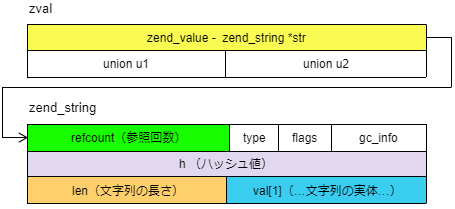

===============
10.文字列の扱い
===============

10.1.文字列の内部構造
=====================

　zval における文字列データは、zend_string として保持されます。zend_string は Zend/zend_types.h により以下のように実装されています。

.. code-block:: c

  typedef struct _zend_string     zend_string;
  
  struct _zend_string {
    zend_refcounted_h gc;
    zend_ulong        h;                /* hash value */
    size_t            len;
    char              val[1];
  };
  
  typedef struct _zend_refcounted_h {
    uint32_t         refcount;      /* reference counter 32-bit */
    union {
      struct {
        ZEND_ENDIAN_LOHI_3(
          zend_uchar    type,
          zend_uchar    flags,    /* used for strings & objects */
          uint16_t      gc_info)  /* keeps GC root number (or 0) and color */
      } v;
      uint32_t type_info;
    } u;
  } zend_refcounted_h;

　単純なコピーに代表される、文字列の中身の変更を伴わない参照の場合、同一の zend_string 領域を複数の zval が指すようにすることで、無駄なメモリコピーが抑えられ、処理速度の向上が見込めます。refcount は、この文字列が何個の zval から参照されているのかを示すカウンターです。refcount がゼロになると、自動的にメモリの開放が行われます。

10.2.文字列関連マクロ
=====================

　文字列に関するマクロやインライン関数は Zend/zend_string.h で定義されています。

.. list-table:: 文字列関連マクロ - ショートカット
  :widths: 5 15 20 30
  :header-rows: 1

  * - No.
    - マクロ宣言
    - 定義
    - 意味
  * - 1
    - ZSTR_VAL(zstr)
    - (zstr)->val
    - 文字列の実体（の先頭アドレス）
  * - 2
    - ZSTR_LEN(zstr)
    - (zstr)->len
    - 文字列の長さ
  * - 3
    - ZSTR_H(zstr)
    - (zstr)->h
    - ハッシュ値
  * - 4
    - ZSTR_HASH(zstr)
    - zend_string_hash_val(zstr)
    - （後述）

　ハッシュ値は、当該システムにおいて、文字列を一意に識別するための整数値です。これにより文字列を高速に検索できるようになっています。

10.3.インライン関数
===================

　多数のインライン関数が用意されています。関数宣言において、冗長な部分は記載を省略しています。

.. list-table:: 文字列関連のインライン関数
  :header-rows: 1

  * - No.
    - 関数宣言
    - 意味
  * - 1
    - | zend_ulong 
      | zend_string_hash_val(zend_string \*s)
    - | ・ハッシュ値が未計算なら計算・保存する
      | ・ハッシュ値を返す
  * - 2
    - | void 
      | zend_string_forget_hash_val(zend_string \*s)
    - ハッシュ値をクリアする
  * - 3
    - | uint32_t
      | zend_string_refcount(const zend_string \*s)
    - 文字列のリファレンスカウントを返す(\*1)
  * - 4
    - | uint32_t
      | zend_string_addref(zend_string \*s)
    - リファレンスカウントをインクリメントして返す(\*1)
  * - 5
    - | uint32_t
      | zend_string_delref(zend_string \*s)
    - リファレンスカウントをデクリメントして返す(\*1)
  * - 6
    - | zend_string
      | \*zend_string_alloc(size_t len, int persistent)
    - 文字列用の領域を確保して返す
  * - 7
    - | zend_string 
      | \*zend_string_safe_alloc
      | (size_t n, size_t m, size_t l, int persistent)
    - 文字列用の領域を確保して返す（詳細調査中）
 
（力尽きたので、いったんここまでで公開します）

* (\*1)…いずれも拘束文字列（'interned string'）の場合は 1 を返します。拘束文字列として定義された zend_string は、HashTable に保存する際に複製されません。
