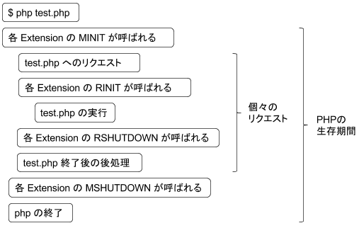
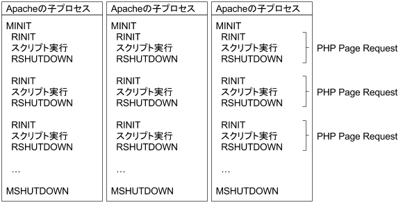

====================
5.PHP 内部の基礎知識
====================

5.1.PHP のソースツリー
======================

　PHP Extension の開発するにあたっては、残念ながらまとまったドキュメントがありません。このため、本格的に開発を始めると、結局は既存の PHP ソースを grep しまくって似たような処理がないかを探し、それを真似るということを繰り返すことになります。そのためには、どこを重点的に探せばいいかを知っておく必要があります。grep 対象として重要なのは、以下のディレクトリです。

.. list-table::
  :widths: 5 15 80
  :header-rows: 1

  * - No.
    - ディレクトリ名
    - 内容
  * - 1
    - Zend
    - Zend Engine。API はここに定義があるので、一番お世話になるところです。
  * - 2
    - ext
    - | Extension。既存の拡張モジュールのソースです。
      | この中から似たような処理を見つけることになります。
  * - 3
    - main
    - | PHP コア。内部の共通関数等があり、ext 配下の 
      | Extension から参照されています。

5.2.疑似グローバル変数
======================

　Zend Engine への入口となる Zend API は、巨大なマクロのかたまりです。今後 ext 配下にある既存のソースを参照しつつ、テンプレートの php/ext/my_ext.c に手を入れていきます。既存のソースを見ていると、その中にはいかにもグルーバル変数のような顔をしているパラメーター変数があったりします。事前に知っておくとソースが追いやすくなるので、最初にご紹介しておきます。

.. _module-name-521:

5.2.1.モジュール名
------------------

　今回のケースでは、my_ext.c の中で以下のように各マクロへの引数として指定されている ``my_ext`` です。

::

    PHP_MINIT_FUNCTION(my_ext)
    PHP_MSHUTDOWN_FUNCTION(my_ext)
    PHP_MINFO_FUNCTION(my_ext)

　PHP_MINIT_FUNCTION マクロを例に取り、引数の扱いを調べてみます。

.. code-block:: bash
  :emphasize-lines: 1,3,5,7

  ~/php$ grep -r PHP_MINIT_FUNCTION . | grep define
  ./main/php.h:#define PHP_MINIT_FUNCTION         ZEND_MODULE_STARTUP_D
  ~/php$ grep -r 'define ZEND_MODULE_STARTUP_D' .
  ./Zend/zend_API.h:#define ZEND_MODULE_STARTUP_D(module)         int ZEND_MODULE_STARTUP_N(module)(INIT_FUNC_ARGS)
  ~/php$ grep -r 'define ZEND_MODULE_STARTUP_N' .
  ./Zend/zend_API.h:#define ZEND_MODULE_STARTUP_N(module)       zm_startup_##module
  ~/php$ grep -r 'define INIT_FUNC_ARGS' .
  ./Zend/zend_modules.h:#define INIT_FUNC_ARGS            int type, int module_number
  ./Zend/zend_modules.h:#define INIT_FUNC_ARGS_PASSTHRU   type, module_number

　つまり ``PHP_MINIT_FUNCTION(my_ext)`` は、C のプリプロセッサにより ``zm_startup_my_ext(int type, int module_number)`` という関数定義に展開されるということがわかります。 ``##`` は文字列の連結を指示するためのプリプロセッサへの命令です。zm_startup_my_ext() という関数名は間接的に生成されたものなので、これをソースツリー内で grep しても出て来ませんが、gdb でデバッグする際にはこれらのシンボルが見えるようになります。

5.2.2.type/module_number
------------------------

　PHP_MINIT_FUNCTION() マクロは ``my_ext`` Extension モジュールをロードした後、最初に呼び出される処理です。上記の grep の結果より、これに対して type と module_number を渡していることがわかります。他にも同様のマクロがあるかもしれません。これらのマクロブロックの中では、 ``type`` と ``module_number`` はあたかもグローバル変数のように見えます。

5.2.3.return_value
------------------

　PHP から認識できる PHP 関数のエントリは、内部的には Zend/zend_API.h で以下のように定義されています。

.. code-block:: c

  typedef struct _zend_function_entry {
    const char *fname;
    void (*handler)(INTERNAL_FUNCTION_PARAMETERS);
    const struct _zend_internal_arg_info *arg_info;
    uint32_t num_args;
    uint32_t flags;
  } zend_function_entry;

　fname が（PHPから見える）関数名、handler が実際の飛び先です。handler に引数として与えられている INTERNAL_FUNCTION_PARAMETERS の定義は以下の通りです。

.. code-block:: bash
  :emphasize-lines: 1

  ~/php$ grep -r 'define INTERNAL_FUNCTION_PARAMETERS' .
  ./Zend/zend.h:#define INTERNAL_FUNCTION_PARAMETERS zend_execute_data *execute_data, zval *return_value

　return_value はユーザーランド（PHP スクリプト）に返される値です。たとえば PHP の `printf() <http://php.net/manual/ja/function.printf.php>`_ 関数は、公式ドキュメントによると以下のように定義されています。

.. php:function:: int printf ( string $format [, mixed $args [, mixed $... ]] )

　この定義に従って printf() を実装する C の内部関数は、return_value に対して PHP の integer 型に相当する値をセットして返す必要があります。

5.3.Extension ソースの構造
==========================

5.3.1.zend_module_entry
-----------------------

　my_ext/my_ext.c の最後の方に、この拡張モジュール全体の構造を示すモジュールエントリの構造体があります。

.. code-block:: c

  zend_module_entry my_ext_module_entry = {
      STANDARD_MODULE_HEADER,
      "my_ext",
      my_ext_functions,
      PHP_MINIT(my_ext),
      PHP_MSHUTDOWN(my_ext),
      PHP_RINIT(my_ext),      /* Replace with NULL if there’s nothing to do at request start */
      PHP_RSHUTDOWN(my_ext),  /* Replace with NULL if there’s nothing to do at request end */
      PHP_MINFO(my_ext),
      PHP_MY_EXT_VERSION,
      STANDARD_MODULE_PROPERTIES
  };

　zend_module_entry の構造体定義は Zend/zend_modules.h にあります。この構造体の中身は、ほぼ変更する必要はありません。開発にあたっては、必要に応じてこれらのマクロの中身を埋めていきます。

　``PHP_`` で始まるマクロは main/php.h で定義されています。これらの役目は以下の通りです。[1]_

.. list-table::
  :widths: 5 15 80
  :header-rows: 1

  * - No.
    - マクロ名
    - 説明
  * - 1
    - PHP_MINIT
    - このモジュールが最初にロードされた際に呼ばれるコールバック関数。
  * - 2
    - PHP_MSHUTDOWN
    - | このモジュールがアンロードされる時（通常はシャットダウン時）
      | に呼ばれるコールバック関数。
  * - 3
    - PHP_RINIT
    - 各リクエストの開始時に呼ばれるコールバック関数。
  * - 4
    - PHP_RSHUTDOWN
    - 各リクエストの終了時に呼ばれるコールバック関数。
  * - 5
    - PHP_MINFO
    - phpinfo() 関数（php -m）が呼び出された際に呼ばれるコールバック関数。
  * - 6
    - | PHP_(モジュール名)
      |   _VERSION
    - | そのモジュールのバージョン情報。
      | ``ext_skel`` がphp_my_ext.h の中にデフォルトの定義を作成します。
      | 必要に応じて Extension の作者が上書きして指定します。

　初期化処理や終了処理が複数あるのは、ライフサイクルの違いから来るものです。PHP のライフサイクルは SAPI 毎に異なります。以下に CLI のケースと Apache Prefork MPM のケースを示します。

  CLI におけるライフサイクル [2]_

  Apache Prefork MPM におけるライフサイクル [2]_

　RINIT / RSHUTDOWN はリクエストのたびに呼ばれるため、これらの処理を極力軽くすることが全体のパフォーマンス向上につながります。これらの処理が不要な場合は、 zend_module_entry のメンバーの値として RINIT / RSHUTDOWN の代わりに NULL を指定します。

.. _zend_function_entry:

5.3.2.zend_function_entry
-------------------------

　前述の zend_module_entry の３番目のプロパティとして、 ``my_ext_functions`` があります。その実体は、 zend_module_entry の直前に定義があります。

.. code-block:: c

  const zend_function_entry my_ext_functions[] = {
      PHP_FE(confirm_my_ext_compiled, NULL) /* For testing, remove later. */
      PHP_FE_END  /* Must be the last line in my_ext_functions[] */
  };

　この構造体は、この拡張モジュールでユーザーランドに対して PHP 関数として公開する、関数エントリの一覧です。デフォルトでは、 ``ext_skel`` が１つだけ ``confirm_my_ext_compiled`` 関数を定義しています。この構造体に必要な分だけ関数エントリを追加していきます。ちゃんと動くようになってきたら、 ``confirm_my_ext_compiled`` のエントリとその関数定義の実体は削除して構いません。エントリの末尾は PHP_FE_END で閉じます。

　PHP_FE や PHP_FE_END マクロは main/php.h で定義されています。といっても、 ``PHP_*`` マクロの実際の定義は Zend/zend_API.h にあるエントリの別名であることが多いです。

.. code-block:: bash
  :emphasize-lines: 1,3,5,7

  ~/php$ grep -rw PHP_FE . | grep -w define
  ./main/php.h:#define PHP_FE                     ZEND_FE
  ~/php$ grep -rw '#define ZEND_FE'
  Zend/zend_API.h:#define ZEND_FE(name, arg_info) ZEND_FENTRY(name, ZEND_FN(name), arg_info, 0)
  ~/php$ grep -rw '#define ZEND_FENTRY'
  Zend/zend_API.h:#define ZEND_FENTRY(zend_name, name, arg_info, flags)   { #zend_name, name, arg_info, (uint32_t) (sizeof(arg_info)/sizeof(struct _zend_internal_arg_info)-1), flags },
  ~/php$ grep -rw '#define ZEND_FN'
  Zend/zend_API.h:#define ZEND_FN(name) zif_##name

　``'#'`` ディレクティブは実引数を文字列化します（``"`` で囲む）。最終的に ``PHP_FE(confirm_my_ext_compiled, NULL)`` は ``{ "confirm_my_ext_compiled", zif_confirm_my_ext_compiled, ... }`` のように展開されるため、``confirm_my_ext_compiled`` というシンボルは ``zif_confirm_my_ext_compiled`` という内部関数名に変換されることになります。

　zend_function_entry と同様に、クラスを定義する zend_class_entry などもありますが、スケルトンとしては生成されないようです。これらの定義は Zend/zend_types.h にあります。

.. [1] PHP 公式マニュアルにも `zend_module 構造体 <http://php.net/manual/ja/internals2.structure.modstruct.php>`_ というページに詳細な説明があるのですが、残念ながら PHP 5.2 の時点までで更新が止まっています。
.. [2] 出典 `Extending and Embedding PHP <https://www.amazon.co.jp/Extending-Embedding-PHP-Developers-Library/dp/067232704X>`_
